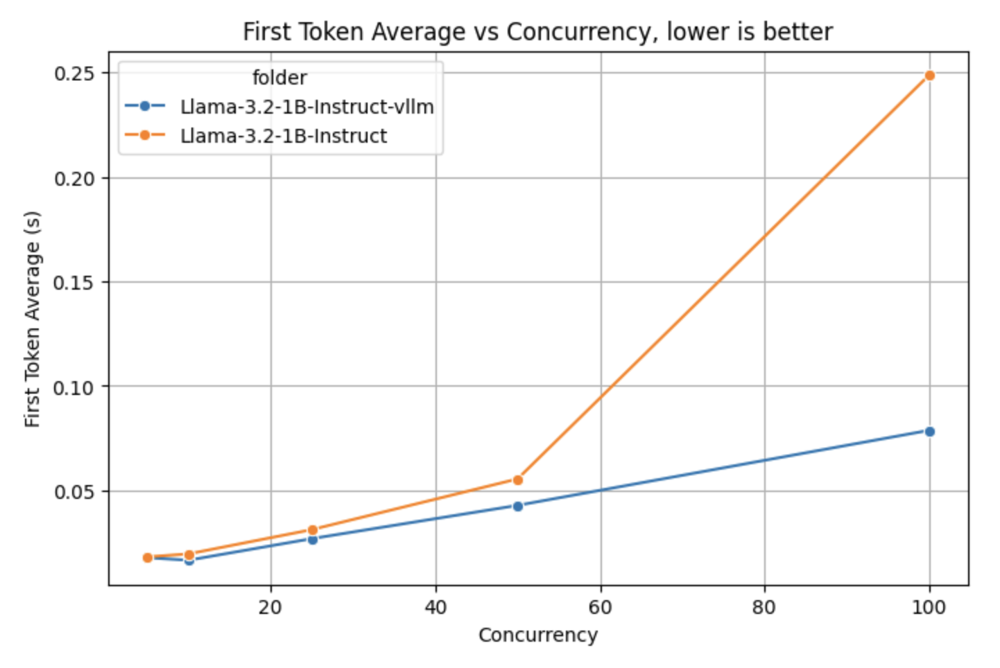
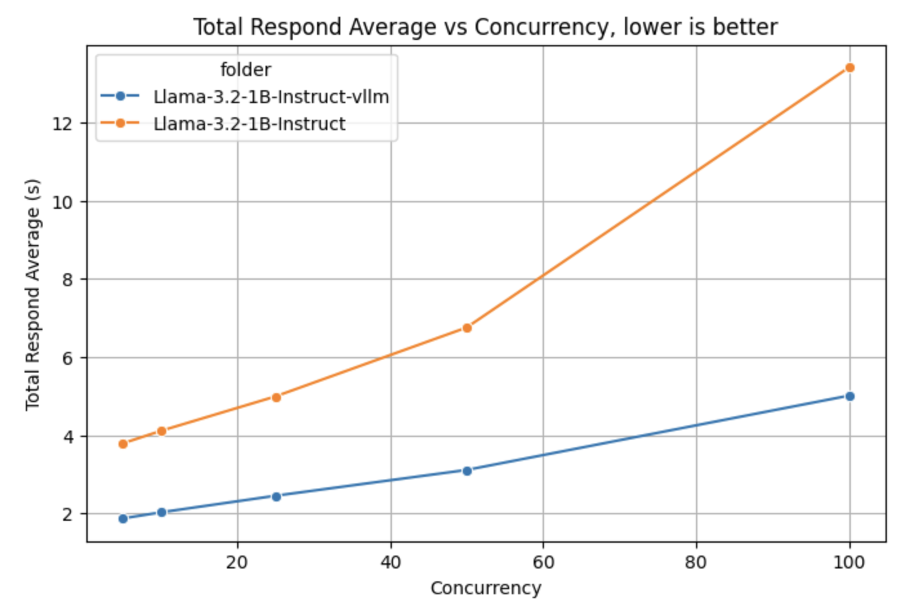
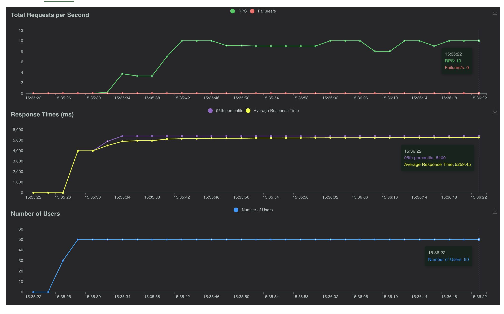
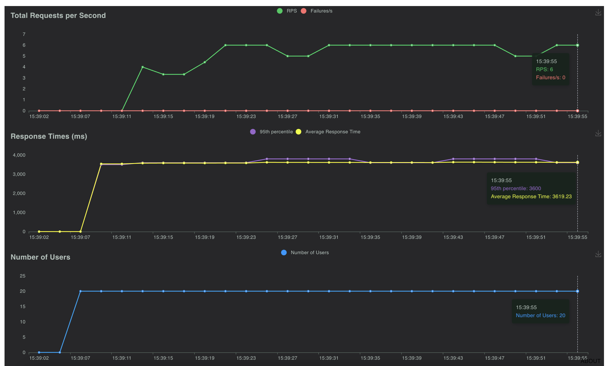
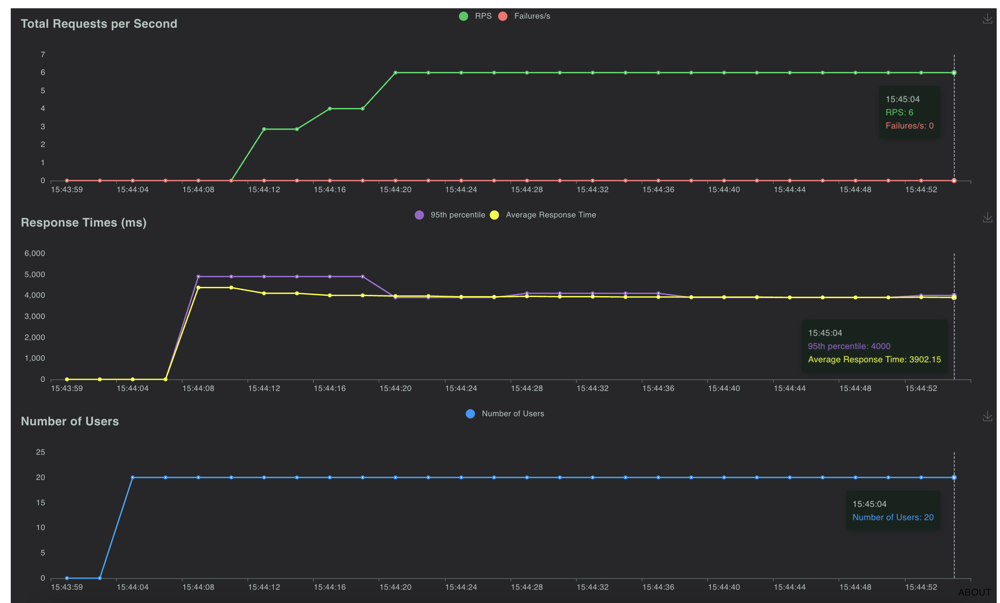
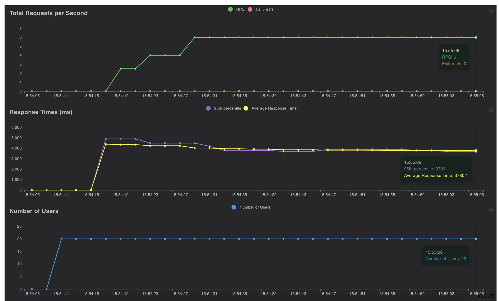
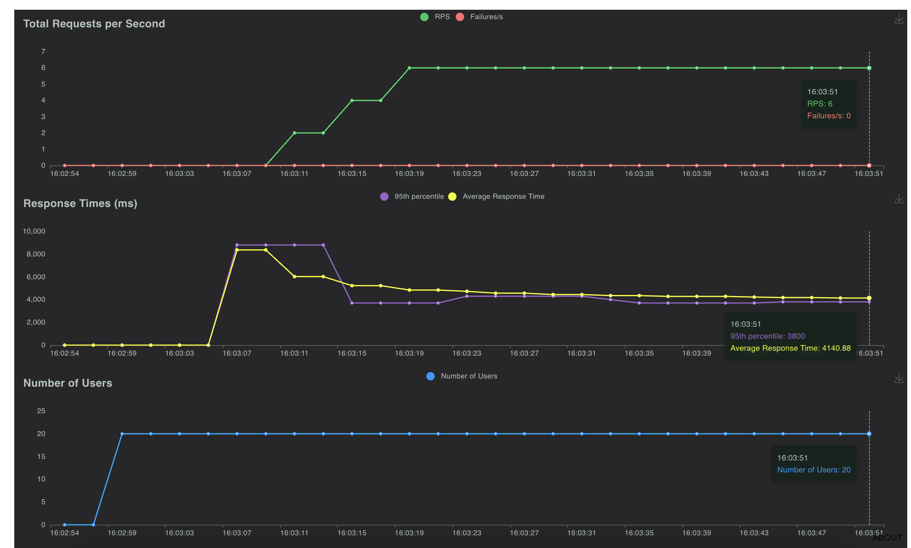

# simple-continuous-batching-flashinfer

Simple continuous batching CausalLM from HuggingFace Transformer using FlashInfer.

1. Simple page KV cache manager.
2. Torch compile support.
3. FP32 support but downcast and upcast attention forward.
4. Support top-k, top-p, temperature and repetition penalty for sampling.

## how to install

Using PIP with git,

```bash
pip3 install git+https://github.com/malaysia-ai/simple-continuous-batching-flashinfer
```

Or you can git clone,

```bash
git clone https://github.com/malaysia-ai/simple-continuous-batching-flashinfer && cd simple-continuous-batching-flashinfer
```

## how to local

### Supported parameters

```bash
python3 -m simple_flashinfer.main --help
```

```text
usage: main.py [-h] [--host HOST] [--port PORT] [--loglevel LOGLEVEL] [--microsleep MICROSLEEP]
               [--max_sequence MAX_SEQUENCE] [--memory_utilization MEMORY_UTILIZATION]
               [--compare-sdpa-prefill COMPARE_SDPA_PREFILL] [--model MODEL] [--torch_dtype TORCH_DTYPE]
               [--torch_dtype_autocast TORCH_DTYPE_AUTOCAST] [--torch_profiling TORCH_PROFILING]
               [--torch_compile TORCH_COMPILE] [--torch_compile_mode TORCH_COMPILE_MODE] [--cuda_graph CUDA_GRAPH]

Configuration parser

options:
  -h, --help            show this help message and exit
  --host HOST           host name to host the app (default: 0.0.0.0, env: HOSTNAME)
  --port PORT           port to host the app (default: 7088, env: PORT)
  --loglevel LOGLEVEL   Logging level (default: INFO, env: LOGLEVEL)
  --microsleep MICROSLEEP
                        microsleep to group batching to reduce CPU burden, 1 / 1e-4 = 10k steps for second (default: 0.0001,
                        env: MICROSLEEP)
  --max_sequence MAX_SEQUENCE
                        max sequence aka batch size per filling or decoding (default: 128, env: MAX_SEQUENCE)
  --memory_utilization MEMORY_UTILIZATION
                        memory utilization on free memory after load the model for automatic number of paging for paged
                        attention (default: 0.9, env: MEMORY_UTILIZATION)
  --compare-sdpa-prefill COMPARE_SDPA_PREFILL
                        Compare FlashInfer attention output with SDPA during prefill (default: False, env:
                        COMPARE_SDPA_PREFILL)
  --model MODEL         Model type (default: meta-llama/Llama-3.2-1B-Instruct, env: MODEL)
  --torch_dtype TORCH_DTYPE
                        Model dtype (default: float16, env: TORCH_DTYPE)
  --torch_dtype_autocast TORCH_DTYPE_AUTOCAST
                        Model dtype autocast if the model loaded in float32 (default: float16, env: TORCH_DTYPE_AUTOCAST)
  --torch_profiling TORCH_PROFILING
                        Use torch.autograd.profiler.profile() to profile prefill and step (default: False, env:
                        TORCH_PROFILING)
  --torch_compile TORCH_COMPILE
                        Torch compile for decoding and sampling (default: False, env: TORCH_COMPILE)
  --torch_compile_mode TORCH_COMPILE_MODE
                        torch compile mode (default: default, env: TORCH_COMPILE_MODE)
  --cuda_graph CUDA_GRAPH
                        Capture CUDA Graph for decoding and sampling (default: False, env: CUDA_GRAPH)
```

**We support both args and OS environment**.

### Run meta-llama/Llama-3.2-1B-Instruct

```bash
python3 -m simple_flashinfer.main \
--host 0.0.0.0 --port 7088 --model meta-llama/Llama-3.2-1B-Instruct
```

```bash
curl -X 'POST' \
  'http://localhost:7088/chat/completions' \
  -H 'accept: application/json' \
  -H 'Content-Type: application/json' \
  -d '{
  "model": "model",
  "temperature": 0.9,
  "top_p": 0,
  "top_k": 0,
  "max_tokens": 256,
  "repetition_penalty": 1,
  "messages": [
    {
      "role": "user",
      "content": "Hello!"
    }
  ],
  "stream": true
}'
```

Output,

```
data: {"id": "bd793d41-3f8f-4142-b762-aec323664b83", "choices": [{"delta": {"content": "Hello", "function_call": null, "role": null, "tool_calls": null}, "finish_reason": null, "index": 0, "logprobs": null}], "created": 1753606017, "model": "model", "object": "chat.completion.chunk", "system_fingerprint": null}

data: {"id": "bd793d41-3f8f-4142-b762-aec323664b83", "choices": [{"delta": {"content": "!", "function_call": null, "role": null, "tool_calls": null}, "finish_reason": null, "index": 0, "logprobs": null}], "created": 1753606017, "model": "model", "object": "chat.completion.chunk", "system_fingerprint": null}

data: {"id": "bd793d41-3f8f-4142-b762-aec323664b83", "choices": [{"delta": {"content": " How", "function_call": null, "role": null, "tool_calls": null}, "finish_reason": null, "index": 0, "logprobs": null}], "created": 1753606017, "model": "model", "object": "chat.completion.chunk", "system_fingerprint": null}

data: {"id": "bd793d41-3f8f-4142-b762-aec323664b83", "choices": [{"delta": {"content": " can", "function_call": null, "role": null, "tool_calls": null}, "finish_reason": null, "index": 0, "logprobs": null}], "created": 1753606017, "model": "model", "object": "chat.completion.chunk", "system_fingerprint": null}

data: {"id": "bd793d41-3f8f-4142-b762-aec323664b83", "choices": [{"delta": {"content": " I", "function_call": null, "role": null, "tool_calls": null}, "finish_reason": null, "index": 0, "logprobs": null}], "created": 1753606017, "model": "model", "object": "chat.completion.chunk", "system_fingerprint": null}

data: {"id": "bd793d41-3f8f-4142-b762-aec323664b83", "choices": [{"delta": {"content": " assist", "function_call": null, "role": null, "tool_calls": null}, "finish_reason": null, "index": 0, "logprobs": null}], "created": 1753606017, "model": "model", "object": "chat.completion.chunk", "system_fingerprint": null}

data: {"id": "bd793d41-3f8f-4142-b762-aec323664b83", "choices": [{"delta": {"content": " you", "function_call": null, "role": null, "tool_calls": null}, "finish_reason": null, "index": 0, "logprobs": null}], "created": 1753606017, "model": "model", "object": "chat.completion.chunk", "system_fingerprint": null}

data: {"id": "bd793d41-3f8f-4142-b762-aec323664b83", "choices": [{"delta": {"content": " today", "function_call": null, "role": null, "tool_calls": null}, "finish_reason": null, "index": 0, "logprobs": null}], "created": 1753606017, "model": "model", "object": "chat.completion.chunk", "system_fingerprint": null}

data: {"id": "bd793d41-3f8f-4142-b762-aec323664b83", "choices": [{"delta": {"content": "?", "function_call": null, "role": null, "tool_calls": null}, "finish_reason": null, "index": 0, "logprobs": null}], "created": 1753606017, "model": "model", "object": "chat.completion.chunk", "system_fingerprint": null}
```

### Torch compile

```bash
python3 -m simple_flashinfer.main \
--host 0.0.0.0 --port 7088 --model meta-llama/Llama-3.2-1B-Instruct \
--torch_compile true
```

You should able to get a bump around 10-20%

#### Reduce overhead

```bash
python3 -m simple_flashinfer.main \
--host 0.0.0.0 --port 7088 --model meta-llama/Llama-3.2-1B-Instruct \
--torch_compile true --torch_compile_mode reduce-overhead --max_sequence 10
```

Feel free to increase `--max_sequence` but it will take a longer time to compile.

#### Max autotune

```bash
python3 -m simple_flashinfer.main \
--host 0.0.0.0 --port 7088 --model meta-llama/Llama-3.2-1B-Instruct \
--torch_compile true --torch_compile_mode max-autotune --max_sequence 10
```

Feel free to increase `--max_sequence` but it will take a longer time to compile.

## Unit tests

The unit tests will cover page append, prefilling causal attention and step decoding causal attention,

```bash
python3 -m unittest test.manager
python3 -m unittest test.manager_append
```

## Benchmark

1. We benchmark on 4096 prefilling and 384 decoding with ignore EOS.
2. Benchmark run on a single RTX 3090 Ti.

```python
python3 benchmark.py \
--model "model" \
--save "benchmark/Llama-3.2-1B-Instruct-warmup" \
--rps-list "5" \
--start_token "<|start_header_id|>" --start_token_length 4096

python3 benchmark.py \
--model "model" \
--save "benchmark/Llama-3.2-1B-Instruct" \
--rps-list "5,10,25,50,100" \
--start_token "<|start_header_id|>" --start_token_length 4096
```

### vLLM

We benchmark with vLLM 0.10.0 disabled prefix caching,

```bash
./vllm/bin/vllm serve "meta-llama/Llama-3.2-1B-Instruct" \
--served-model-name "model" \
--tensor_parallel_size "1" \
--no-enable-prefix-caching \
--max-model-len=8192 \
--port 7088
```

After that run the benchmark,

```bash
python3 benchmark.py \
--model "model" \
--url "http://localhost:7088/v1/completions" \
--save "benchmark/Llama-3.2-1B-Instruct-vllm-warmup" \
--rps-list "5" \
--start_token "<|start_header_id|>" --start_token_length 4096

python3 benchmark.py \
--model "model" \
--url "http://localhost:7088/v1/completions" \
--save "benchmark/Llama-3.2-1B-Instruct-vllm" \
--rps-list "5,10,25,50,100" \
--start_token "<|start_header_id|>" --start_token_length 4096
```

### Comparison

#### First Time Token VS Concurrency



#### Average Time Token VS Concurrency



## Stress test

```bash
locust -f stress_test.py -P 7001 -H http://localhost:7088 -r 10 -u 50 -t 60
```



### Stress test Torch compile

Because compiling takes a very long time, we just stress test 20 users same size as `--max_sequence`,

```bash
locust -f stress_test.py -P 7001 -H http://localhost:7088 -r 10 -u 20 -t 60
```

The stress test done on `transformers==4.53.1`, `torch==2.7.1` and `flashinfer-python==0.2.8`.

#### Disable

```bash
python3 -m simple_flashinfer.main \
--host 0.0.0.0 --port 7088 --model meta-llama/Llama-3.2-1B-Instruct \
--torch_compile false --max_sequence 20
```



#### Default

```bash
python3 -m simple_flashinfer.main \
--host 0.0.0.0 --port 7088 --model meta-llama/Llama-3.2-1B-Instruct \
--torch_compile true --torch_compile_mode default --max_sequence 20
```



#### Reduce overhead

```bash
python3 -m simple_flashinfer.main \
--host 0.0.0.0 --port 7088 --model meta-llama/Llama-3.2-1B-Instruct \
--torch_compile true --torch_compile_mode reduce-overhead --max_sequence 20
```



#### Max autotune

```bash
python3 -m simple_flashinfer.main \
--host 0.0.0.0 --port 7088 --model meta-llama/Llama-3.2-1B-Instruct \
--torch_compile true --torch_compile_mode max-autotune --max_sequence 20
```

